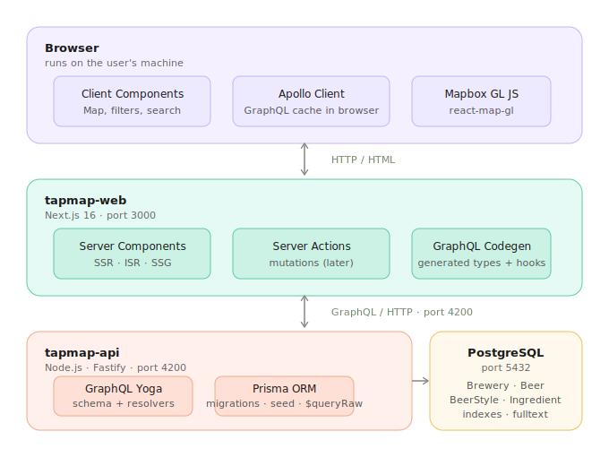
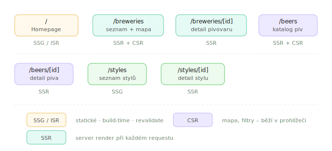
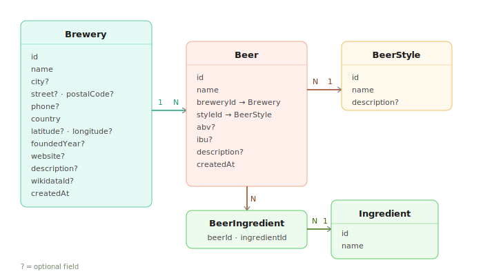

# TapMap – Architecture

## Overview

Craft beer brewery catalog with interactive map. Learning project focused on fullstack development: Next.js, GraphQL, PostgreSQL.

**Tech stack:** Next.js 16 · Node.js · GraphQL Yoga · Prisma ORM · PostgreSQL · Mapbox GL JS · TypeScript

---

## Project Structure

Two independent Node.js projects in a single monorepo:

```
tapmap/
├── tapmap-api/     # Node.js · Fastify · GraphQL Yoga · Prisma
├── tapmap-web/     # Next.js 16 · React · Apollo Client · Mapbox
└── docs/
```

- **tapmap-api** runs on port 4200
- **tapmap-web** runs on port 3000
- No monorepo tooling (Turborepo etc.) – two independent package.json files

---

## Architecture Overview



### tapmap-api

Node.js backend with GraphQL API.

| Layer          | Technology    |
| -------------- | ------------- |
| HTTP server    | Fastify       |
| GraphQL server | GraphQL Yoga  |
| ORM            | Prisma 7      |
| Database       | PostgreSQL 17 |
| Language       | TypeScript    |

**Responsibilities:**

- GraphQL schema + resolvers
- Database access via Prisma Client
- Complex queries via Prisma `$queryRaw` (aggregations, fulltext search)
- Database migrations and seeding

### tapmap-web

Next.js frontend, connects to tapmap-api via GraphQL.

| Layer           | Technology                  |
| --------------- | --------------------------- |
| Framework       | Next.js 16 (App Router)     |
| GraphQL client  | Apollo Client               |
| Map             | Mapbox GL JS (react-map-gl) |
| Type generation | GraphQL Codegen             |
| Language        | TypeScript                  |

**Key pattern:**
Server Components fetch data from tapmap-api GraphQL endpoint directly.
Client Components (map, filters) use Apollo Client in the browser.

---

## Rendering Strategy



---

## Data Model



| Model          | Key fields                                                               |
| -------------- | ------------------------------------------------------------------------ |
| Brewery        | id, name, city, country, latitude, longitude, type, foundedYear, website |
| Beer           | id, name, abv, ibu, breweryId, styleId, description                      |
| BeerStyle      | id, name, description, origin                                            |
| Ingredient     | id, name                                                                 |
| BeerIngredient | beerId, ingredientId (composite PK)                                      |

**BreweryType enum:** `MICRO · REGIONAL · INDUSTRIAL · BREWPUB`

---

## Database

PostgreSQL 17 with Prisma 7 ORM.

- **Prisma Config** – `prisma.config.ts` in project root (Prisma 7) – configures DATABASE_URL, schema location, migrations path
- **Prisma Client** – typesafe queries for standard CRUD operations
- **Prisma Migrate** – versioned SQL migrations
- **`$queryRaw`** – complex queries: aggregations, GROUP BY, fulltext search
- **Indexes** – on `country`, `type`, `breweryId`, `styleId`, fulltext GIN index

---

## Data Sources

| Source              | Content                           | Method                    |
| ------------------- | --------------------------------- | ------------------------- |
| Open Brewery DB API | EU breweries with geo coordinates | fetch at seed time        |
| Wikidata SPARQL     | Czech breweries missing from OBDB | SPARQL query at seed time |
| beer.db             | Beers linked to breweries         | CSV import                |
| AI generated        | Czech breweries and beers fill-in | JSON → seed script        |

---

## GraphQL & Types

Schema defined in `tapmap-api` as single source of truth.
GraphQL Codegen generates TypeScript types for both projects:

```
tapmap-api/schema.graphql
        ↓ graphql-codegen
tapmap-api/generated/     → resolver types
tapmap-web/generated/     → Apollo hooks + query types
```

---

## Deployment

| Part       | Platform                                 |
| ---------- | ---------------------------------------- |
| tapmap-web | Vercel (root directory: tapmap-web)      |
| tapmap-api | Railway or Render                        |
| PostgreSQL | Railway or Render (same platform as API) |

Both Vercel projects connect to the same GitHub repository with different root directories.
